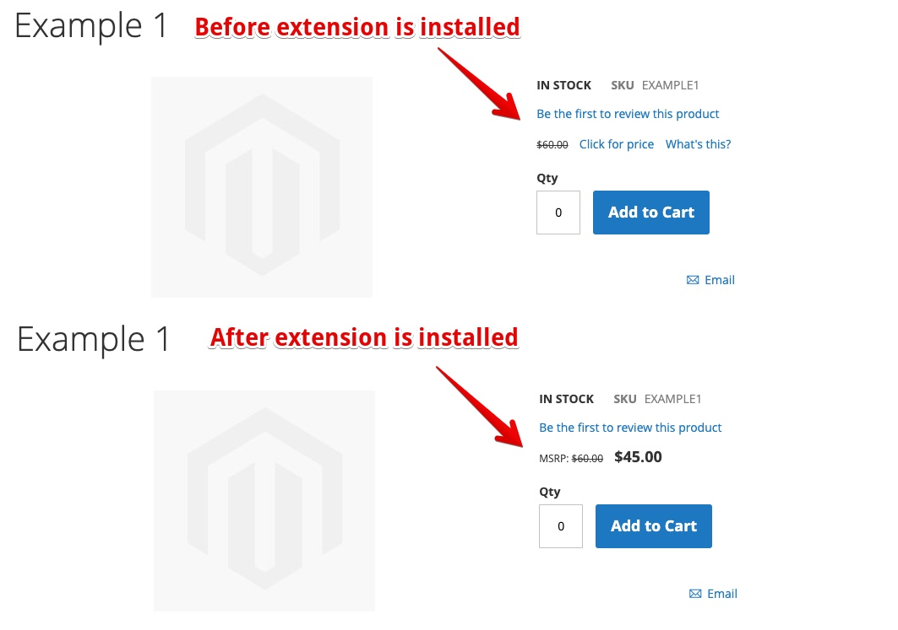

# Kraken DisplayMsrpInline Extension

## Description

In Magento 1, if an admin added an `msrp` price, the `msrp` and regular price would display on the product page. Magento 2 added "Minimum Advertised Price" functionality that by default hides the regular price until you click a "Click for price" link. This extension removes that "Minimum Advertised Price" functionality and displays both the `msrp` and regular price.

* Display the `msrp` price value inline on page, rather than requiring a user to interact with the page
* Adds `msrp` display to grouped products (since it doesn't work natively in Magento 2.3.2)

## Usage Instructions

* Install extension (make sure you apply the patch in the `patches` folder)
* Go to "STORES -> Configuration > SALES > Sales > Minimum Advertised Price" and change "Enable MAP" to "Yes"
* Edit any product, click on "Advanced Pricing". Add a value to the "Manufacturer's Suggested Retail Price" input that is higher than the `price`
* View the product on the frontend and you'll see the normal price AND the MSRP price displayed on the page:
  
  

## Installation Instructions

First, apply the patch in `patches/` to the `magento/module-catalog` module using the `composer-patches` plugin. More details on how to do that [here](https://www.classyllama.com/blog/create-apply-patches-magento-2).

The reason we applied this change as a patch instead of a `preference` is that is prevents us from copying forward multiple core methods into this plugin.

Snippet of what your `composer.json` file should look like after you apply the patch:
```
    "extra": {
        "magento-force": "override",
        "composer-exit-on-patch-failure": true,
        "patches": {
            "magento/module-catalog": {
                "Display MSRP prices in addition to other prices": "vendor/kraken/module-display-msrp-inline/patches/magento-module-catalog-display-msrp.patch"
            }
        }
    }
```

After you do the above, ensure the `vendor/magento/module-catalog/Pricing/Render/FinalPriceBox.php` file has the changes in the patch file.

### Option 1 - Install extension using Composer (default approach)

```bash
composer config repositories.kraken/module-display-msrp-inline git https://github.com/krakencommerce/magento2-module-display-msrp-inline.git
composer require kraken/module-display-msrp-inline:dev-master
bin/magento module:enable --clear-static-content Kraken_DisplayMsrpInline
bin/magento setup:upgrade
bin/magento cache:flush
```

### Option 2 - Install extension by copying files into project (only if the project requires it for some reason)

```bash
mkdir -p app/code/Kraken/DisplayMsrpInline
git archive --format=tar --remote=git@github.com:krakencommerce/magento2-module-display-msrp-inline.git master | tar xf - -C app/code/Kraken/DisplayMsrpInline/
bin/magento module:enable --clear-static-content Kraken_DisplayMsrpInline
bin/magento setup:upgrade
bin/magento cache:flush
```

## Uninstallation Instructions

These instructions work regardless of how you installed the extension:

```bash
bin/magento module:disable --clear-static-content Kraken_DisplayMsrpInline
rm -rf app/code/Kraken/DisplayMsrpInline
composer remove kraken/module-display-msrp-inline
mr2 db:query 'DELETE FROM `setup_module` WHERE `module` = "Kraken_DisplayMsrpInline"'
bin/magento cache:flush
```
